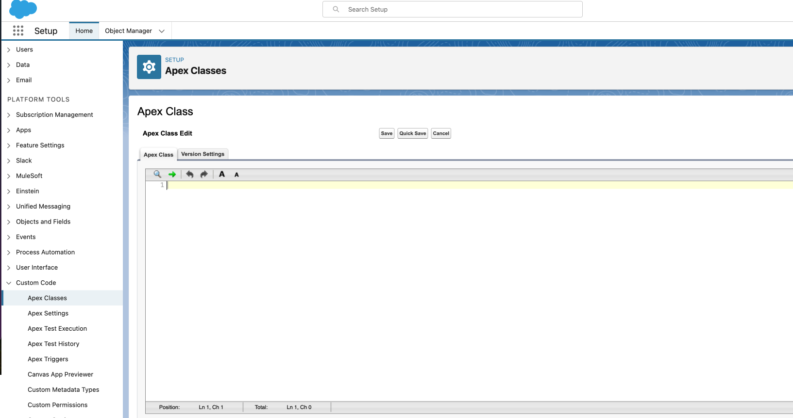

## GOV.UK One Login Relying Party Application

This is an example code on integrating SalesForce with Gov.UK OneLogin. It is intended as a reference and doesn't represent production-quality code.

## Pre-Requisites
- SalesForce Account
- Create a key pair for the private_key_jwt assertion
- Create Custom Metadata Types for the GOV.UK endpoints required for Apex class auth.AuthenticationPlugin

### Custom Metadata types

Custom metadata is customizable, deployable, packageable, and upgradeable application metadata. First, you create a custom metadata type, which defines the form of the application metadata. Then, you build reusable functionality that determines the behaviour based on metadata of that type.

#### Create Custom Metadata Manually

Create Custom Metadata Types in Salesforce via Custom Code | Custom Metadata Types.

- Authorize Endpoint URL
- Consumer Key
- Default Scopes
- PrivateKey
- Redirect URL
- Send access token in header
- Token Endpoint URL
- User Info Endpoint URL
Refer to the documentation for more information: https://help.salesforce.com/s/articleView?id=sf.custommetadatatypes_overview.htm&type=5

#### Import an existing Custom Metadata types

  Install Custom Metadata Type Data Loader as per instruction here : https://appexchange.salesforce.com/appxListingDetail?listingId=a0N4V00000HrQTdUAN

 **Import the CustomMetaDataType.xls(clients/Apex-SalesForce/CustomMetaDataType.xls) to create and populate the GOV.UK One Login OIDC endpoints and mandatory requirement such as Private Key.

### Import the Apex code into Salesforce

Salesforce provides a development console for debugging and testing code.

- Add the Private_Key_JWT via Custom Code | Apex Classes | New to create a new Apex class.

- Once Added goto Identity | Auth.Prodivers | New and select the JWTGovUK under the Provider Type drop down list.

- The output should look similar to the following image :
- Provide the Redirect URL and public_key.pem file to GOV.UK One Login Team so that your service can be registered.
