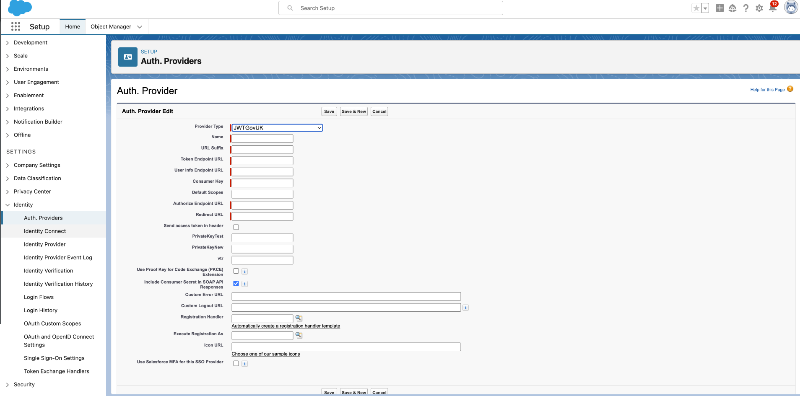

## GOV.UK One Login Relying Party Application

This is an example code on integrating SalesForce with Gov.UK OneLogin. It is intended as a reference and doesn't represent production-quality code.

## Pre-Requisites
- SalesForce Account
- Create a key pair for the private_key_jwt assertion
- Create Custom Metadata Types for the GOV.UK endpoints required for Apex class auth.AuthenticationPlugin

### Custom Metadata types

Custom metadata is customizable, deployable, packageable, and upgradeable application metadata. First, you create a custom metadata type, which defines the form of the application metadata. Then, you build reusable functionality that determines the behaviour based on that type of metadata.

#### Create Custom Metadata Manually

Create Custom Metadata Types in Salesforce per the screenshot above and add the following custom Fields.

- Authorize Endpoint URL
- Consumer Key
- Default Scopes
- PrivateKey
- Redirect URL
- Send access token in the header
- Token Endpoint URL
- User Info Endpoint URL

**Refer to the documentation for more information: https://help.salesforce.com/s/articleView?id=sf.custommetadatatypes_overview.htm&type=5**

#### Import an existing Custom Metadata types

 - Install Custom Metadata Type Data Loader as per instruction here: https://appexchange.salesforce.com/appxListingDetail?listingId=a0N4V00000HrQTdUAN.
 - Import the CustomMetaDataType.xls(clients/Apex-SalesForce/CustomMetaDataType.xls).

### Import the Apex code into Salesforce

- Add your Apex code in Salesforce via **Custom Code | Apex Classes | New** to create a new Apex class, as shown in the screenshot below.

- Add the imported Apex code as an identity provider in SalesForce via **Identity | Auth.Prodivers | New** Select your Apex class under the **Provider Type** drop-down list.

- The output should look similar to the following image:
