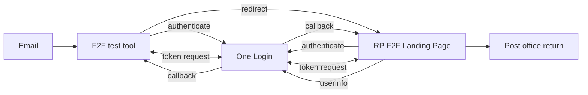
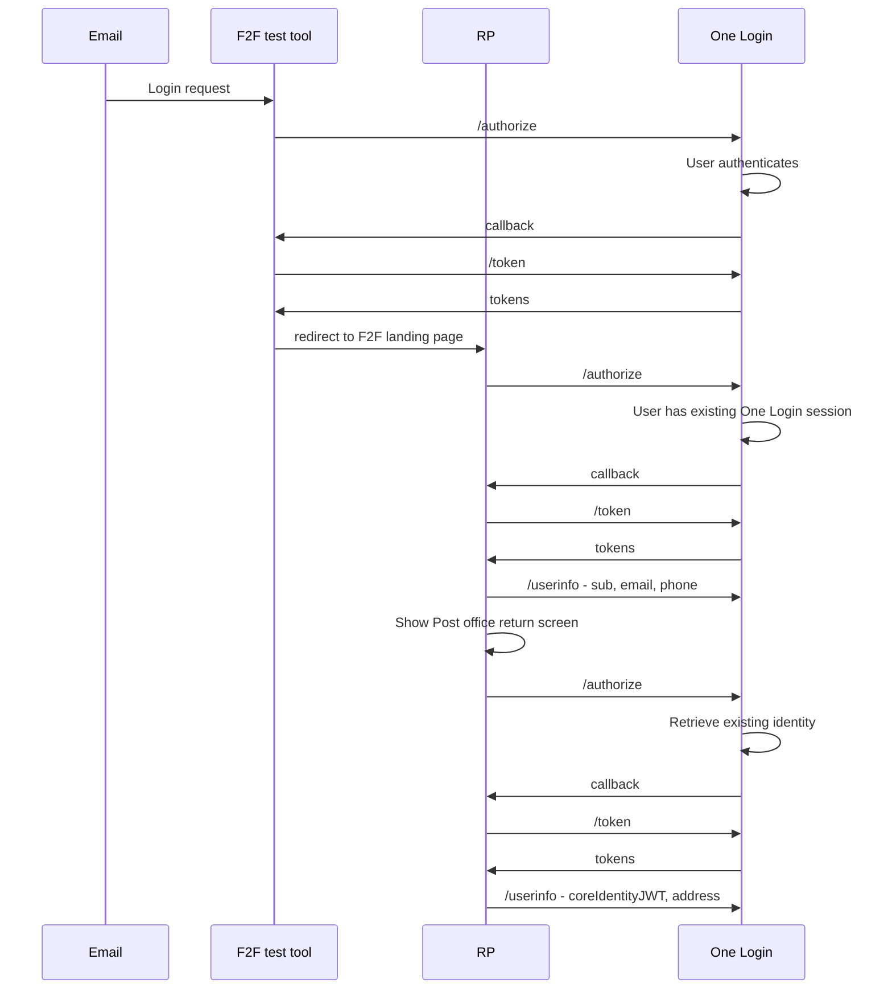

# Generate a Time-based one-time password (TOTP) in TypeScript

A simple relgying party implementation that simulates the in person identity check retuyrn process.

This tool can be used to test the implementation of your "landing page". There is more guidance about [creating a landing page](LINK).

## Usage

```bash

npm install
npm run build
npm run start

```

Once the example is running, assuming you are running on the default port and localhost make a request as shown below:

```bash

http://localhost:8083

```

You will be redirected to an example email to start the test process. Click on the link in the email.

## Configuration

Most of the configuration is the same as a standard relying part, except `F2F_LANDING_PAGE_URL`.

F2F_LANDING_PAGE_URL should be the URL you want the user redirected to after clicking the link in the post office return email and successfully authenticating.

## This example can also be run in Docker

`docker compose up --build`

## How it works

1. User clicks link to F2F test tool in email
1. User is redirected to GOV.UK One Login to authenticate
1. User signs in to their existing account
1. User is redirected to F2F test tool
1. User is redirected to the RP's F2F landing page
1. User is redirected to GOV.UK One Login to authenticate
1. User does not need to sign because they have an existing GOV.UK One Login session
1. User is redirected to RP's redirect URL
1. RP requests userinfo data: `email`, `phone` and `sub`
1. RP shows user the Post Office return screen
1. User clicks Request identity check result
1. User is redirected to GOV.UK One Login for identity verification
1. User is shown idenityt reuse screen
1. User is redirected to RP's redirect URL
1. RP requests userinfo data: `coreidentityJWT` and `address` etc.




