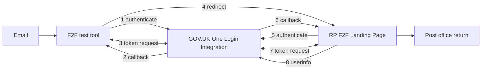
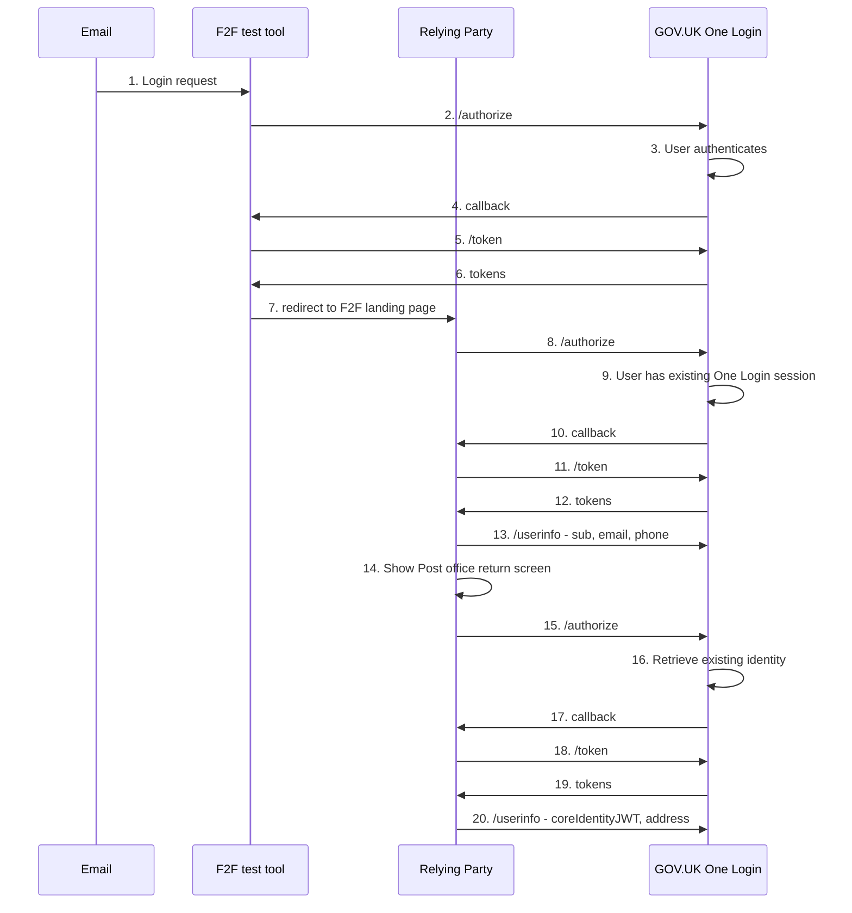

# Typescript tool to simulate the face to face (F2F) check return process

A simple relying party implementation that simulates the face to face (F2F) check return process.  

This tool can be used to test the implementation of your "landing page". There is more guidance about [creating a landing page](https://docs.sign-in.service.gov.uk/LINK).



## Usage

### 1. Configuration

Most of the configuration is the same as a the example application (see the Quickstart ["Run the example service using the GOV.UK One Login integration environment"](https://docs.sign-in.service.gov.uk/quick-start/#run-the-example-service-using-the-gov-uk-one-login-integration-environment)). Follow the instructions to configure the example with the integration environment to run that example relying party locally on port `8080`. This example hosts an example landing page at http://localhost:8080/landing-page.

In the `f2f-test` directory configure the `.env` file as follows:
- duplicate the example configuration with `cp .env.example .env`
- set `OIDC_CLIENT_ID` to the client ID
- set `OIDC_PRIVATE_KEY` to the private key (without headers and linefeeds, all on one line)
- set `F2F_LANDING_PAGE_URL` to `http://localhost:8080/landing-page`, the URL you want the user redirected to after clicking the link in the post office return email and successfully authenticating.

### 2.1 Start the F2F tool with Typescript

```bash
npm install
npm run build
npm run start
```

### 2.2 Start the F2F tool with Docker Compose

`docker compose up --build`

### 3. Start the journey

Once the example is running, assuming you are running on the default port and localhost make a request as shown below:

`http://localhost:8083`

You will be redirected to an example email to start the test process. Click on the link in the email and you will be lead through the process.


## How it works




1. User clicks link to F2F test tool in email
1. User is redirected to GOV.UK One Login to authenticate
1. User signs in to their existing account
1. /token
1. returns tokens
1. User is redirected to F2F test tool
1. User is redirected to the RP's F2F landing page
1. User is redirected to GOV.UK One Login to authenticate
1. the user does not need to sign because they have an existing GOV.UK One Login session
1. User is redirected to RP's redirect URL
1. /token
1. return tokens
1. RP requests userinfo data: `email`, `phone` and `sub`
1. RP shows user the Post Office return screen
1. User clicks Request identity check result
1. User is redirected to GOV.UK One Login for identity verification
1. User is shown identity reuse screen
1. User is redirected to RP's redirect URL
1. /token
1. return tokens
1. RP requests userinfo data: `coreidentityJWT` and `address` etc
