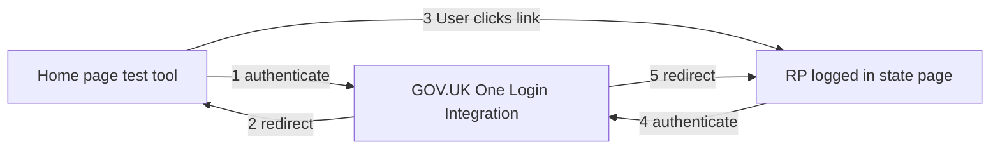
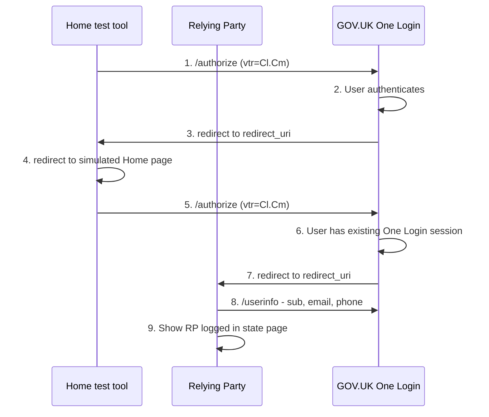

# Typescript tool to simulate the Home page service card link

A simple relying party implementation that simulates the GOV.UK One Login Home service card link.  

This tool can be used to test the implementation of your service's "logged in state page".



## Usage

### 1. Configuration

Most of the configuration is the same as a the example application (see the Quickstart ["Run the example service using the GOV.UK One Login integration environment"](https://docs.sign-in.service.gov.uk/quick-start/#run-the-example-service-using-the-gov-uk-one-login-integration-environment)). Follow the instructions to configure the example with the integration environment to run that example relying party locally on port `8080`. This example hosts an example logged in state page at <http://localhost:8080/home>.

In the `home-test` directory configure the `.env` file as follows:

- duplicate the example configuration e.g. `cp .env.example .env` or `copy .env.example .env`
- create a new client using the [GOV.UK One Login Admin Tool](https://admin.sign-in.service.gov.uk/)
- set `OIDC_CLIENT_ID` to the client ID
- set `OIDC_PRIVATE_KEY` to the private key (without headers and linefeeds, all on one line)
- set `RP_ACCOUNT_SERVICE_NAME` to the name of the service you are testing
- set `RP_ACCOUNT_SERVICE_DESCRIPTION` to the description of the service you are testing
- set `RP_ACCOUNT_SERVICE_URL` to the logged in state url in the service that you are testing
- set `RP_ACCOUNT_SERVICE_URL_TEXT` to the text for the logged in state url in the service you are testing

### 2.1 Start the F2F tool with Typescript

```bash
npm install
npm run build
npm run start
```

### 2.2 Start the F2F tool with Docker Compose

`docker compose up --build`

### 3. Start the journey

Once the example is running, assuming you are running on the default port and localhost make a request as shown below:

`http://localhost:8084`

You will be redirected to the GOV.UK One Login start page to start the test process.

## How it works



1. Home page test tool starts up and redirects user to GOV.UK One Login integration environment
1. User signs in to their existing account
1. User is redirected to Home page test tool
1. User is redirected to simulated Home page
1. User clicks on link to RP service
1. the user does not need to sign because they have an existing GOV.UK One Login session
1. User is redirected to RP's redirect URL
1. RP requests userinfo data: `email`, `phone` and `sub`
1. RP shows user logeed in state page
