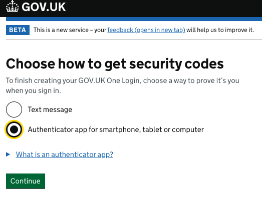
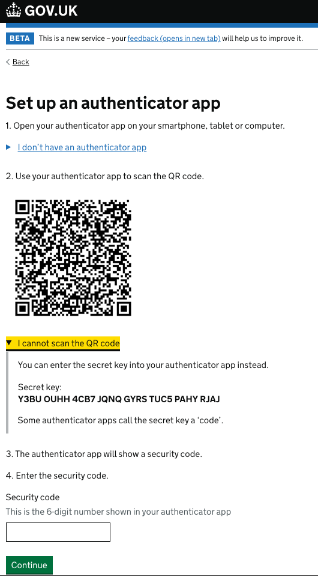

# Generate a Time-based one-time password (TOTP) in TypeScript

A simple example that creates an API endpoint that generates a [TOTP](https://en.wikipedia.org/wiki/Time-based_one-time_password) in accordance with IETF [rfc6238](https://datatracker.ietf.org/doc/html/rfc6238) code using Node.js and TypeScript.

## Usage

```bash
npm install
npm run build
npm run start
```

Once the example is running, assuming you are running on the default port and localhost make a request as shown below:

```bash

http://localhost:8081/totp-generator?secret=Y3BUOUHH4CB7JQNQGYRSTUC5PAHYRJAJ

```

## How to get the secret key

You need to supply the tool with a secret key to generate the one time codes.

Follow the GOV.UK One Login journey to register.



Select the "Authenticator app for smartphone, tablet or computer" option and click Continue.



Click the "I cannot scan the QR code" link copy the secret key (in this example it is `Y3BU OUHH 4CB7 JQNQ GYRS TUC5 PAHY RJAJ`) and pass it as the `secret` parameter to the API endpoint

## This example can also be run in Docker

`docker compose up --build`
